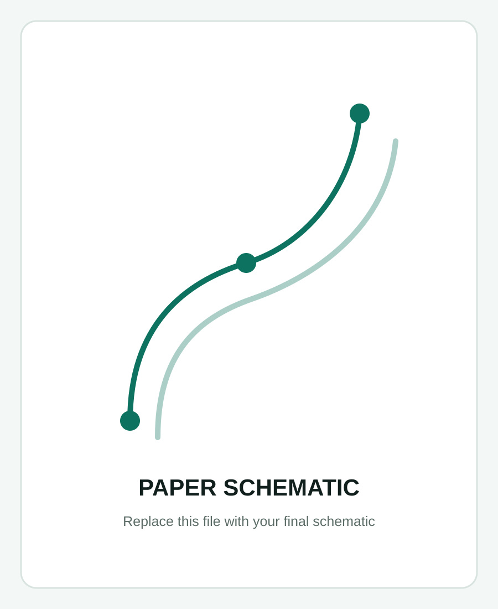
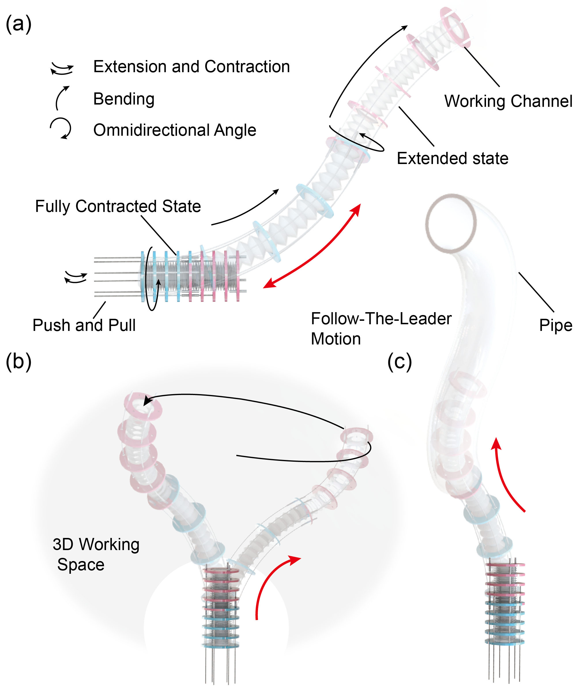

# Simplified project page

This version keeps the original 1440 px maximum page width and simplifies the public-facing layout.

## What changed

- Abstract is now a two-column block: abstract text on the left, paper schematic on the right.
- Experimental demos sit directly below the abstract in the requested 1 / 4 / 3 / 3 / 2 video-row layout.
- Shape Planning now exposes only a short **INTERACTION** guide and the 3D viewport.
- The Method section was removed.
- The FTL section now exposes only a short **INTERACTION** guide, one **Run / Replay FTL** button, and the 3D viewport.
- The old technical controls are still kept invisibly in the DOM so the existing JavaScript model continues to work.
- Shape Planning no longer shows the old shape-following replay body overlay.
- FTL automatically starts replaying after the browser finishes planning.

## Add the schematic

1. Put your final schematic in `media/`.
2. Either name it `schematic-placeholder.svg` to replace the placeholder directly, or edit this line in `index.html`:

```html

```

For example:

```html

```

PNG, JPG, WebP, and SVG all work.

## Add the 15 experiment videos

Put MP4 files in `media/` with these exact names:

```text
demo-01.mp4
demo-02.mp4
demo-03.mp4
demo-04.mp4
demo-05.mp4
demo-06.mp4
demo-07.mp4
demo-08.mp4
demo-09.mp4
demo-10.mp4
demo-11.mp4
demo-12.mp4
demo-15.mp4
```

The rows are already fixed as:

- Row 1: demo-01
- Row 2: demo-02 to demo-05
- Row 3: demo-06 to demo-08
- Row 4: demo-09 to demo-11
- Row 5: demo-12 to demo-15

To change a caption, edit the corresponding `<figcaption>` in `index.html`.

## Recommended video export

For a GitHub Pages project page, MP4 encoded with H.264 video and AAC audio is the safest browser-compatible choice. Use 720p or 1080p and compress aggressively enough that the repository does not become unnecessarily large.

If the videos are very large, host them outside the Git repository and replace each `<source src="./media/demo-XX.mp4">` URL with the hosted URL.

## Test locally

From the project folder, run:

```bash
python -m http.server 8000
```

Then open:

```text
http://localhost:8000
```

Do not test by double-clicking `index.html`, because ES modules and browser security rules may prevent the Three.js modules from loading correctly from `file://`.

## Deploy to GitHub Pages

If this folder is the root of your existing GitHub Pages repository:

```bash
git add .
git commit -m "Simplify project page layout"
git push
```

GitHub Pages will update after the push is processed. Hard-refresh the browser if an older CSS/JS file remains cached.


## Updated experiment-gallery layout

Desktop layout: **1 / 4 / 3 / 2 / 3 / 2** videos per row.

- `demo-01.mp4` remains the wide hero video.
- `demo-02.mp4` through `demo-15.mp4` use taller 4:3 display cards with `object-fit: contain`, so the browser does not crop the original experiment frame.
- If you are upgrading from the previous 13-video layout, insert the two new videos as `demo-09.mp4` and `demo-10.mp4`, then renumber the previous `demo-09.mp4` ... `demo-13.mp4` to `demo-11.mp4` ... `demo-15.mp4`.

## Refined interactive controls

The public Shape Planning panel now exposes only the controls that are useful to a paper visitor:
- trajectory family: J, 2D-C, 2D-S, 3D-C, 3D-S;
- segment-length bounds;
- numeric P1 transition point;
- numeric P2 terminal point;
- reset/refine actions.

The detailed solver state is shown as a compact LIVE OUTPUT strip below the planner. The FTL demo keeps its simplified interaction panel and adds a single horizontal LIVE OUTPUT row for L1–L6 below the simulation viewport.

## Visual refinement in this version

- Shape Planning P1 marker is smaller.
- Planned path uses real 3D tubes (red + blue) for reliable thickness across browsers.
- FTL view removes all spherical point markers.
- Simulated robot body remains blue/red but is slimmer.
- Base, middle, and tip coordinate frames use thicker 3D RGB arrows and are enabled by default.
- FTL reference path uses exactly the same red/blue colors and tube radius as Shape Planning.


## FTL controls-restored revision
- Restores the original FTL reference-path colors (muted gray/green) while keeping the thicker path geometry.
- Restores the three structural path-point spheres P0, P1, and P2.
- Restores Reference path and Rod-length planner controls, stage cards, status, metrics, and rod-length output.
- Keeps the separate Playback/Replay control panel hidden. Running the simulation still animates the generated motion.
- Keeps the slimmer simulated robot body and thicker coordinate frames from the prior visual refinement.

## Final refinement in this build

- The FTL section keeps the clean title + viewer + rod-length output layout.
- Only the original left-side FTL interaction/planner controls are restored.
- Playback/replay controls, stage cards, current-reference chip, viewer overlays, and metric cards remain hidden.
- The FTL reference path uses the restored muted colors and the P0/P1/P2 geometry spheres remain visible.
- The schematic caption has been removed and the schematic image fills its entire card (`object-fit: cover`).


## Latest UI defaults
- Shape Planning opens on **3D-S** by default.
- The Shape Planning live-output panel is hidden from the public page.
- FTL **Waypoints** defaults to **120** (slider can be reduced).
- **Iterations per waypoint** defaults to its maximum, **36**.
- The FTL status box at the bottom of the left control panel is hidden.
- The descriptive line directly below both interactive-demo titles is removed.


## J trajectory default (v4)
The J preset is matched to the supplied CSV: P0=(0,0,0), P1=(0,0,100) mm, P2=(0,90,190) mm, with T0=+Z and terminal tangent T2=+Y. The resulting second primitive is a 90 mm radius quarter-circle.
